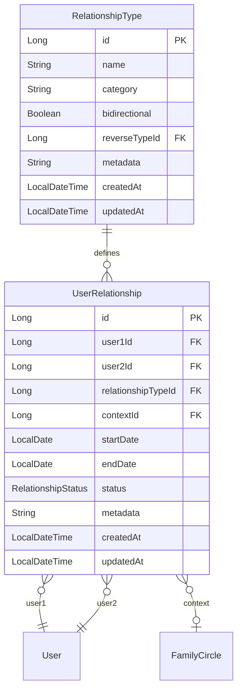

# Relationship Service Architecture

## Overview
The Relationship Service is designed to handle the complex domain of user relationships in a flexible, scalable, and maintainable way. It follows Domain-Driven Design (DDD) principles and implements a microservices architecture pattern.

## Domain Model

### Core Concepts

#### Relationship
A connection between two users with a specific type and context. Relationships are:
- **Bidirectional**: Each relationship has a reverse relationship
- **Temporal**: Can have start and end dates
- **Contextual**: Can exist within specific contexts (family circles, groups)
- **Status-aware**: Can be active, ended, suspended, or pending

#### Relationship Type
Defines the nature of a relationship:
- **Predefined Types**: Standard relationships (Father, Son, Spouse, etc.)
- **Custom Types**: User-defined relationship types
- **Categories**: Family, Social, Professional, Custom
- **Bidirectional**: Whether the relationship works both ways

#### Context
The environment or group where a relationship exists:
- **Family Circles**: Family groups and circles
- **Social Groups**: Friend groups, communities
- **Professional Networks**: Work relationships, professional circles

## Architecture Patterns

### 1. Domain-Driven Design (DDD)

#### Bounded Context
The Relationship Service represents the "Relationship Management" bounded context, which includes:
- Relationship definitions and types
- Relationship lifecycle management
- Relationship validation and rules
- Relationship queries and analytics

#### Domain Entities
- **RelationshipType**: Defines relationship types and their properties
- **UserRelationship**: Represents actual relationships between users
- **RelationshipStatus**: Enum for relationship states
- **RelationshipCategory**: Enum for relationship categories

#### Domain Services
- **RelationshipService**: Core business logic for relationship management
- **RelationshipValidationService**: Business rules and validation
- **RelationshipTypeService**: Management of relationship types

### 2. Microservices Architecture

#### Service Boundaries
The Relationship Service is bounded by:
- **Input**: User relationship requests and queries
- **Output**: Relationship data and events
- **Dependencies**: User Service (user validation), Family Circle Service (context)

#### Service Communication
- **Synchronous**: REST APIs for real-time operations
- **Asynchronous**: Event publishing for data consistency
- **Service Discovery**: Eureka for dynamic service location

### 3. Event-Driven Architecture

#### Domain Events
- **RelationshipCreatedEvent**: Published when a relationship is created
- **RelationshipUpdatedEvent**: Published when a relationship is updated
- **RelationshipDeletedEvent**: Published when a relationship is deleted
- **RelationshipStatusChangedEvent**: Published when relationship status changes

#### Event Flow
```
User Action → Relationship Service → Event Publisher → Other Services
```

## Data Model

### Entity Relationships



### Database Design

#### Normalization Strategy
- **3NF Compliance**: Eliminates redundancy while maintaining performance
- **Denormalization**: Strategic denormalization for query performance
- **Indexing**: Optimized indexes for common query patterns

#### Performance Considerations
- **Composite Indexes**: For multi-column queries
- **Partial Indexes**: For filtered queries (active relationships)
- **JSONB**: For flexible metadata storage

## Service Layer Architecture

### 1. Controller Layer
- **REST Controllers**: Handle HTTP requests and responses
- **Request Validation**: Input validation and sanitization
- **Response Mapping**: DTO to Entity mapping
- **Error Handling**: Consistent error responses

### 2. Service Layer
- **Business Logic**: Core relationship management logic
- **Validation**: Business rules and constraints
- **Transaction Management**: ACID compliance
- **Event Publishing**: Domain event publishing

### 3. Repository Layer
- **Data Access**: JPA/Hibernate for database operations
- **Query Optimization**: Custom queries for performance
- **Caching**: Strategic caching for frequently accessed data

### 4. Security Layer
- **JWT Authentication**: Token-based authentication
- **Authorization**: Role-based access control
- **Input Sanitization**: XSS and injection prevention

## API Design

### RESTful API Principles
- **Resource-based URLs**: Clear resource identification
- **HTTP Methods**: Proper use of GET, POST, PUT, DELETE
- **Status Codes**: Meaningful HTTP status codes
- **Content Negotiation**: JSON response format

### API Versioning
- **URL Versioning**: `/v1/relationships`
- **Header Versioning**: `Accept: application/vnd.legacykeep.v1+json`
- **Backward Compatibility**: Maintain compatibility for at least 2 versions

### Response Format
```json
{
  "success": true,
  "message": "Relationship created successfully",
  "data": {
    "id": 1,
    "user1Id": 100,
    "user2Id": 200,
    "relationshipType": {
      "id": 1,
      "name": "Father",
      "category": "FAMILY"
    },
    "status": "ACTIVE",
    "createdAt": "2024-01-01T00:00:00Z"
  },
  "timestamp": "2024-01-01T00:00:00Z"
}
```

## Security Architecture

### Authentication
- **JWT Tokens**: Shared secret with other services
- **Token Validation**: Automatic validation on all endpoints
- **Token Refresh**: Support for token refresh mechanism

### Authorization
- **Role-based Access**: Admin, User roles
- **Resource-based Access**: Users can only access their own relationships
- **Context-based Access**: Access based on family circle membership

### Data Protection
- **Input Validation**: Comprehensive validation on all inputs
- **SQL Injection Prevention**: JPA/Hibernate protection
- **XSS Protection**: Input sanitization
- **Rate Limiting**: API rate limiting for abuse prevention

## Scalability Considerations

### Horizontal Scaling
- **Stateless Design**: No server-side session state
- **Load Balancing**: Support for multiple service instances
- **Database Sharding**: Potential for database sharding by user ID

### Performance Optimization
- **Caching Strategy**: Redis for frequently accessed data
- **Database Indexing**: Optimized indexes for query performance
- **Connection Pooling**: HikariCP for database connection management
- **Async Processing**: Asynchronous event processing

### Monitoring and Observability
- **Health Checks**: Liveness and readiness probes
- **Metrics**: Prometheus metrics for monitoring
- **Logging**: Structured logging with correlation IDs
- **Tracing**: Distributed tracing for request flow

## Integration Patterns

### 1. Service-to-Service Communication
- **Synchronous**: REST APIs for real-time operations
- **Asynchronous**: Event-driven communication
- **Circuit Breaker**: Fault tolerance for external service calls
- **Retry Logic**: Exponential backoff for failed requests

### 2. Data Consistency
- **Eventual Consistency**: Acceptable for relationship data
- **Saga Pattern**: For distributed transactions
- **Event Sourcing**: For audit trails and data reconstruction

### 3. Error Handling
- **Graceful Degradation**: Continue operation with reduced functionality
- **Fallback Mechanisms**: Default responses for failed operations
- **Error Propagation**: Meaningful error messages to clients

## Deployment Architecture

### Containerization
- **Docker**: Containerized deployment
- **Multi-stage Builds**: Optimized Docker images
- **Health Checks**: Container health monitoring

### Orchestration
- **Kubernetes**: Container orchestration
- **Service Mesh**: Istio for service-to-service communication
- **Config Management**: ConfigMaps and Secrets

### CI/CD Pipeline
- **Build**: Maven build with tests
- **Test**: Unit, integration, and performance tests
- **Deploy**: Automated deployment to staging and production
- **Monitor**: Post-deployment monitoring and alerting

## Future Considerations

### Technology Evolution
- **Graph Databases**: Potential migration to Neo4j for complex relationships
- **Event Sourcing**: Full event sourcing implementation
- **CQRS**: Command Query Responsibility Segregation
- **Microservices Patterns**: Saga, API Gateway, Service Mesh

### Feature Enhancements
- **Relationship Analytics**: Insights and analytics on relationships
- **Relationship Templates**: Predefined relationship structures
- **Advanced Queries**: Complex relationship queries and traversals
- **Relationship Recommendations**: AI-powered relationship suggestions

### Performance Improvements
- **Caching**: Advanced caching strategies
- **Database Optimization**: Query optimization and indexing
- **Async Processing**: More asynchronous processing
- **CDN Integration**: Content delivery for static resources

## Conclusion
The Relationship Service architecture is designed to be flexible, scalable, and maintainable. It follows industry best practices and is built to handle the complex domain of user relationships while maintaining high performance and reliability.

The architecture supports:
- **Flexibility**: Easy to add new relationship types and features
- **Scalability**: Horizontal scaling and performance optimization
- **Maintainability**: Clean code and clear separation of concerns
- **Reliability**: Fault tolerance and error handling
- **Security**: Comprehensive security measures
- **Observability**: Monitoring and debugging capabilities
